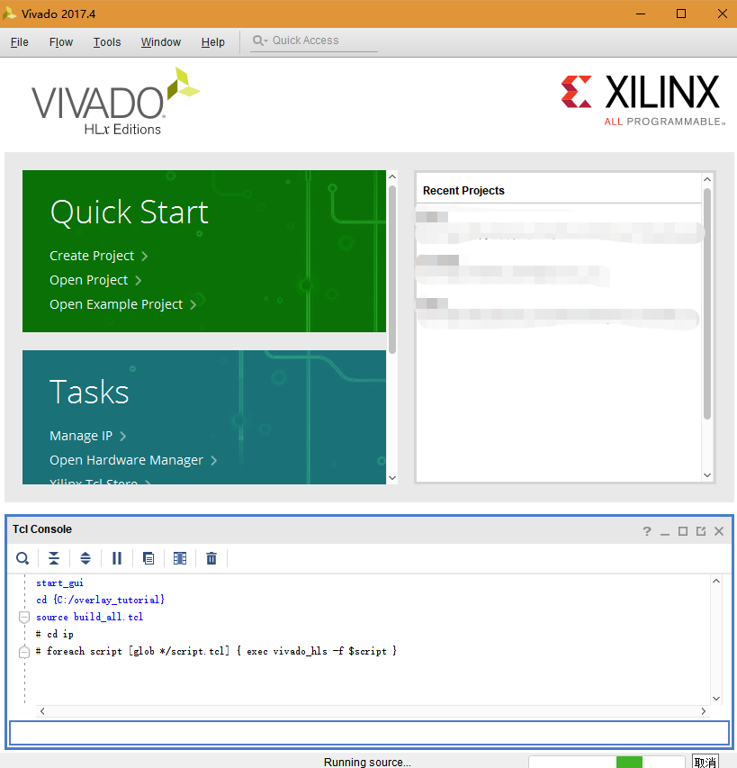
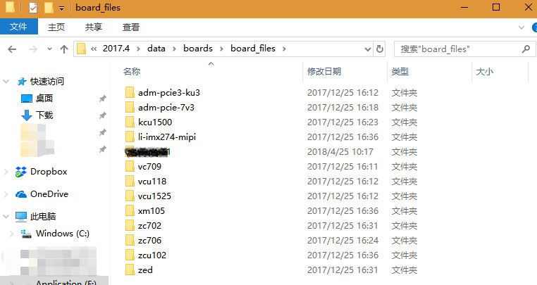

# Overlay Tutorial Support Files

This repository contains the example files for the overlay tutorial
documentation and notebook for the `PYNQ-Z1 board` and `PYNQ-Z2 board`.

## Usage
First clone this repo to local PYNQ-Z1/Z2 board.
```console
cd /home/xilinx/jupyter_notebooks
git clone https://github.com/sonnyhcl/overlay_tutorial.git
```
Then you can visit it in `<<pynq_ip>>:9090/tree/overlay_tutorial/notebook`

## Hardware rebuilt
To rebuild the bitstreams:
 * Open Vivado 2017.4
 * In the TCL consolde run `cd <<This directory>>`
 * and `source build_all.tcl`



## Note
You will need the Digilent board files installed to successfully recreate the
project [https://github.com/Digilent/vivado-boards] and unzip it as below.

